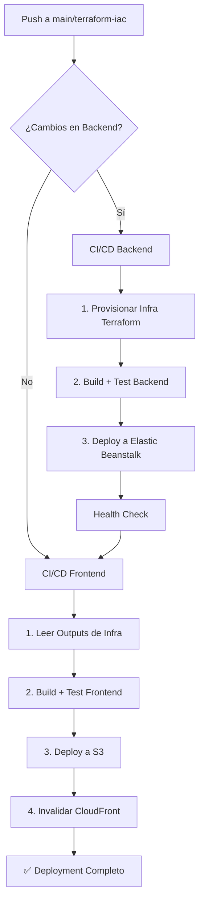

# 🚀 CI/CD Pipelines - Social Graph Activity Feed

## 📋 Resumen Ejecutivo

Este proyecto tiene **4 pipelines automatizados** que gestionan el ciclo de vida completo de la aplicación:

| Pipeline | Propósito | Tecnologías | Coverage |
|----------|-----------|-------------|----------|
| **CI/CD Backend** | Infraestructura + Build + Deploy Backend | Terraform, Node.js, Elastic Beanstalk | 83.25% |
| **CI/CD Frontend** | Build + Deploy Frontend | React, Vite, S3, CloudFront | 89.81% |
| **Tests Unitarios** | Validar utilidades de testing | Python, pytest | 95-100% |
| **Terraform Infra** | Provisionar infraestructura standalone | Terraform, AWS | N/A |

---

## 🔧 Pipeline 1: CI/CD Backend (`main.yml`)

**Trigger**: Push o PR a `main`/`terraform-iac` en carpetas `Backend/**` o `terraform/**`

### Jobs:

#### 1️⃣ **infra** - Provisionar Infraestructura AWS
```
✅ Configura credenciales AWS
✅ Inicializa Terraform (backend S3 + DynamoDB lock)
✅ Terraform Plan (solo en PRs para validación)
✅ Terraform Apply (solo en main/terraform-iac)
✅ Exporta outputs: eb_bucket, eb_app, eb_env, cloudfront_backend_id
```

**Recursos provisionados**:
- S3 bucket para deployments
- Elastic Beanstalk (app + environment)
- CloudFront distribution (backend)
- MongoDB connection config

**Concurrency**: Bloquea múltiples `terraform apply` simultáneos por rama

---

#### 2️⃣ **backend** - Build y Test
```
✅ Setup Node.js 22
✅ Install dependencies (npm ci)
✅ Lint backend (npm run lint)
✅ Test backend con coverage (npm test)
   → 198 tests, 83.25% coverage
   → Controllers, Models, Middlewares
✅ Upload coverage reports
✅ Upload código backend (artifact para deploy)
```

**Servicios**: MongoDB en contenedor (para tests)

---

#### 3️⃣ **deploy** - Deploy a Elastic Beanstalk
```
✅ Download backend code (artifact)
✅ Crear estructura de deployment
✅ Instalar dependencias de producción (npm install --omit=dev)
✅ Crear .zip con aplicación
✅ Upload a S3 bucket
✅ Crear versión en Elastic Beanstalk
✅ Actualizar environment con nueva versión
✅ Verificar deployment (health check)
✅ Invalidar caché CloudFront
```

**Condiciones**: Solo ejecuta en push a `main`/`terraform-iac` (no en PRs)

**Dependencias**: `infra` y `backend` deben completarse exitosamente

---

## 🎨 Pipeline 2: CI/CD Frontend (`frontend-deploy.yml`)

**Trigger**: 
- Push a `main`/`terraform-iac` en carpeta `Frontend/**`
- Cuando termina workflow "CI/CD Backend"
- Manual (workflow_dispatch)

### Jobs:

#### 1️⃣ **get-infra-outputs** - Leer Estado Terraform
```
✅ Terraform init (solo lectura, no apply)
✅ Extraer outputs: s3_bucket, cloudfront_frontend_id, cloudfront_backend_url
```

**Nota**: NO modifica infraestructura, solo lee el estado

---

#### 2️⃣ **ci** - Build y Test Frontend
```
✅ Setup Node.js 22
✅ Install dependencies (npm ci)
✅ Lint frontend (npm run lint)
✅ Test frontend con coverage (npm run test:coverage)
   → 207 tests, 89.81% coverage
   → Componentes React, Contexts, Pages
✅ Build producción (npm run build)
   → VITE_API_URL dinámico desde outputs de infra
✅ Upload build (artifact)
✅ Upload coverage reports
```

**Variables de entorno**: `VITE_API_URL` se configura con la URL del backend de CloudFront

---

#### 3️⃣ **deploy** - Deploy a S3 + CloudFront
```
✅ Download build (artifact)
✅ Configurar credenciales AWS
✅ Sincronizar con S3 (aws s3 sync)
   → Elimina archivos viejos
   → Headers optimizados para cache
✅ Invalidar caché CloudFront
✅ Verificar deployment (curl)
```

**Optimizaciones**:
- Cache-Control headers configurados
- Eliminación de archivos obsoletos
- Invalidación de caché automática

---

## 🧪 Pipeline 3: Tests Unitarios (`cinetrack-tests.yml`)

**Trigger**: Push o PR a `main`/`terraform-iac` en carpeta `tests/**`

### Jobs:

#### 1️⃣ **unit-tests** - Ejecutar Tests de Utilidades
```
✅ Setup Python 3.11
✅ Install pytest dependencies
✅ Run unit tests (pytest tests/unit)
   → test_selenium_helpers.py (100%)
   → test_utils.py (99%)
✅ Coverage report (--cov=tests/unit --cov=tests/utils)
   → 95-100% coverage de utilidades
✅ Upload a Codecov
✅ Upload test reports
```

**Propósito**: Validar que las herramientas de testing (helpers, utilities) funcionen correctamente

**Nota**: NO ejecuta tests E2E/Integration (requieren servidores corriendo)

---

## 🏗️ Pipeline 4: Terraform Infra (`infra.yml`)

**Trigger**: Push o PR a `main` en carpeta `terraform/**`

### Jobs:

#### 1️⃣ **plan-apply** - Gestión de Infraestructura Standalone
```
✅ Configurar credenciales AWS
✅ Setup Terraform 1.9.5
✅ Terraform Init
✅ Terraform Plan (en PRs)
✅ Terraform Apply (solo en main)
```

**Diferencia con main.yml**: Este es un pipeline standalone solo para cambios de infraestructura

**Uso**: Para modificaciones de Terraform sin tocar código de aplicación

---

## 🔐 Secretos Requeridos

### AWS
- `AWS_ACCESS_KEY_ID`
- `AWS_SECRET_ACCESS_KEY`
- `AWS_REGION` (us-east-2)

### Terraform
- `TF_BACKEND_BUCKET` - S3 para Terraform state
- `TF_LOCK_TABLE` - DynamoDB para locking
- `TF_VAR_mongodb_uri` - URI de MongoDB

---

## 📊 Métricas de Calidad

### Coverage Actual
| Componente | Statements | Functions | Tests |
|------------|-----------|-----------|-------|
| **Backend** | 83.25% | 86.3% | 198 |
| **Frontend** | 89.81% | 79.38% | 207 |
| **Test Utils** | 95-100% | 95-100% | N/A |

### Objetivos
- ✅ Backend: >80% (logrado 83.25%)
- ✅ Frontend: >85% (logrado 89.81%)
- ✅ Tests Unitarios: >95% (logrado 95-100%)

---

## 🔄 Flujo Completo de Deployment



---

## 🛡️ Prácticas DevOps Implementadas

### ✅ Seguridad
- Credenciales en GitHub Secrets (nunca en código)
- IAM roles con permisos mínimos
- Terraform state remoto encriptado (S3 + DynamoDB)

### ✅ Calidad
- Lint obligatorio en todos los PRs
- Tests con coverage mínimo
- Build validation antes de deploy

### ✅ Automatización
- Deploy automático en merge a main
- Rollback manual disponible (Elastic Beanstalk versioning)
- Cache invalidation automática (CloudFront)

### ✅ Observabilidad
- Coverage reports en artifacts
- Health checks post-deployment
- Test summaries en GitHub Actions UI

### ✅ Eficiencia
- Concurrency control (evita conflictos Terraform)
- Dependency caching (npm, pip)
- Conditional deployments (solo si cambia código relevante)

---

## 🎯 Puntos Clave para Defender Tu Trabajo

### 1. **Separación de Responsabilidades**
- Backend y Frontend son pipelines independientes
- Infraestructura se gestiona antes que aplicación
- Tests unitarios separados de tests de aplicación

### 2. **Infraestructura como Código (IaC)**
- Todo en Terraform (reproducible, versionado)
- State remoto con locking (evita corrupciones)
- Plan en PRs, Apply solo en main (validación)

### 3. **CI/CD Completo**
- Lint → Test → Build → Deploy → Verify
- Coverage tracking automático
- Artifacts preservados 30 días

### 4. **Alta Disponibilidad**
- Elastic Beanstalk con auto-scaling
- CloudFront como CDN global
- Health checks automáticos

### 5. **Seguridad Primero**
- Secrets management con GitHub Secrets
- Credenciales AWS con acciones oficiales
- Variables de entorno inyectadas en build time

---

## 🚨 Manejo de Errores

### Si falla Terraform
- Revisar logs en GitHub Actions
- Verificar state lock en DynamoDB
- Comando manual: `terraform unlock <LOCK_ID>`

### Si falla Backend Tests
- Coverage mínimo: 80%
- Revisar coverage report en artifacts
- Tests deben pasar antes de merge

### Si falla Frontend Build
- Verificar VITE_API_URL correcta
- Revisar dependencias (npm ci)
- Build local: `npm run build`

### Si falla Deployment
- Elastic Beanstalk: Revisar eventos en AWS Console
- CloudFront: Esperar propagación (5-10 min)
- Rollback: Cambiar versión en EB Console

---

## 📚 Comandos Útiles

### Local Development
```bash
# Backend
cd Backend/servidor
npm install
npm test
npm run lint

# Frontend  
cd Frontend/front-cinetrack
npm install
npm run test:coverage
npm run build

# Tests Unitarios
cd tests
pip install -r requirements.txt
pytest tests/unit -v
```

### Terraform Manual
```bash
cd terraform
terraform init
terraform plan
terraform apply
terraform destroy  # ⚠️ Cuidado
```

### AWS CLI
```bash
# Ver estado de Elastic Beanstalk
aws elasticbeanstalk describe-environments --application-name social-graph-app

# Invalidar CloudFront manualmente
aws cloudfront create-invalidation --distribution-id <ID> --paths "/*"

# Ver objetos en S3
aws s3 ls s3://<bucket-name>
```

---

## 📞 Contacto y Documentación

- **Repositorio**: CineTrack-Social-Graph-Activity-Feed/socialgraphactivityfeed
- **Branch Principal**: `terraform-iac`
- **Región AWS**: `us-east-2`
- **Infraestructura**: AWS (S3, CloudFront, Elastic Beanstalk)

---

**Última actualización**: 2025-11-10  
**Versión**: 1.0  
**Autor**: DevOps Team
